# ContractGuard AI - Architecture Documentation

## System Overview

ContractGuard AI is a multi-agent contract intelligence platform built on Google ADK.

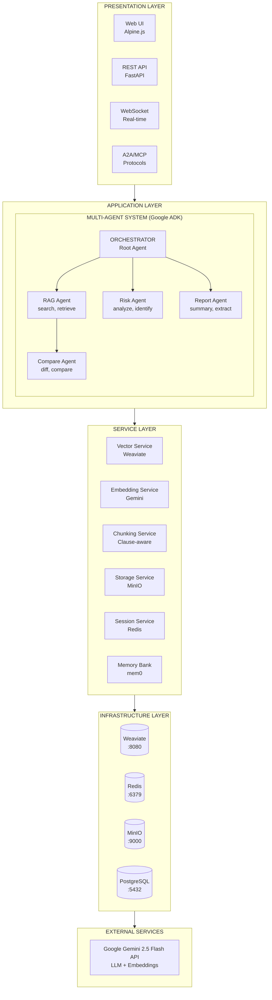

---

## Service Endpoints & Monitoring

### Service URLs (Local Development)

| Service | URL | Purpose | Health Check |
|---------|-----|---------|--------------|
| **API** | http://localhost:8000 | Main application | `/health` |
| **Web UI** | http://localhost:8000/ | Frontend interface | N/A |
| **API Docs** | http://localhost:8000/docs | Swagger UI | N/A |
| **Metrics** | http://localhost:8000/metrics | App metrics | N/A |
| **Weaviate** | http://localhost:8080 | Vector database | `/v1/.well-known/ready` |
| **Weaviate gRPC** | localhost:50051 | gRPC interface | N/A |
| **Redis** | localhost:6379 | Sessions/cache | `PING` command |
| **MinIO API** | http://localhost:9000 | Object storage | `/minio/health/live` |
| **MinIO Console** | http://localhost:9001 | Storage UI | N/A |
| **PostgreSQL** | localhost:5432 | Metadata DB | `pg_isready` |

### Health Check Commands

```bash
# Check all services at once
make health

# Individual service checks
curl http://localhost:8000/health                    # API
curl http://localhost:8080/v1/.well-known/ready      # Weaviate
curl http://localhost:9000/minio/health/live         # MinIO
docker compose -f deploy/docker-compose.yml exec redis redis-cli ping    # Redis
docker compose -f deploy/docker-compose.yml exec postgres pg_isready -U postgres  # PostgreSQL
```

### Metrics Endpoint

```bash
# Get application metrics
curl http://localhost:8000/metrics
```

Returns:
```json
{
  "agents": { ... },
  "tools": { ... },
  "queries": {
    "count": 10,
    "avg_duration_ms": 2500.5,
    "min_duration_ms": 1200,
    "max_duration_ms": 5000,
    "errors": 0
  }
}
```

---

## Agent System (Google ADK)

### Agent Hierarchy

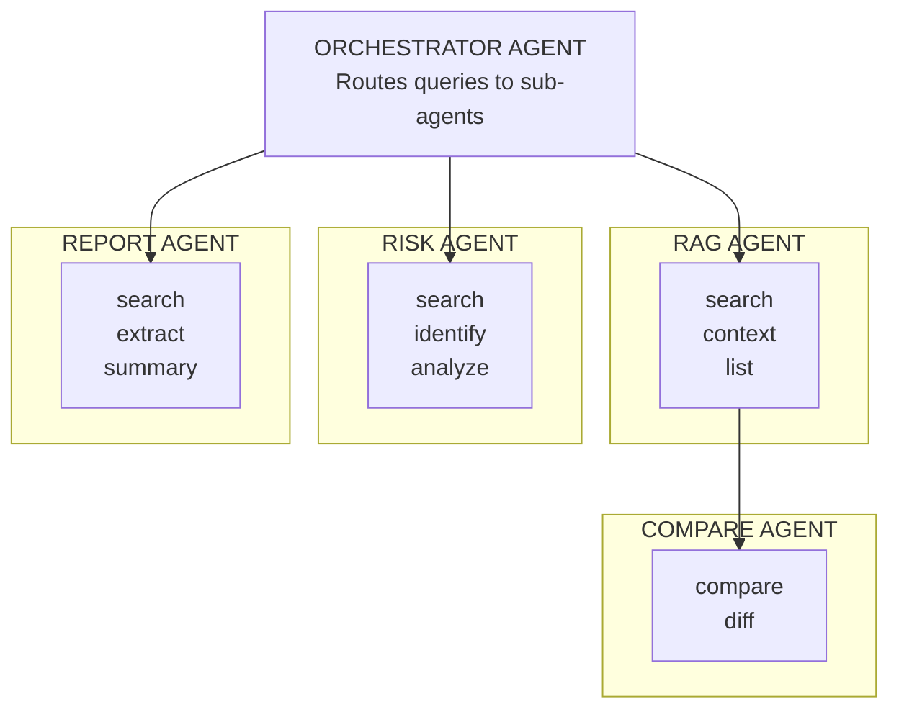

### Google ADK Integration

```python
# Orchestrator with sub-agents
orchestrator = Agent(
    name="contractguard_orchestrator",
    model=LiteLlm(model="gemini/gemini-2.0-flash-exp"),
    instruction=ORCHESTRATOR_INSTRUCTION,
    sub_agents=[rag_agent, risk_agent, compare_agent, report_agent],
)
```

### Agent Responsibilities

| Agent | Primary Role | Tools Used |
|-------|--------------|------------|
| **Orchestrator** | Route requests, coordinate sub-agents | N/A (delegates) |
| **RAG Agent** | Document search, Q&A | search_contracts, get_contract_context |
| **Risk Agent** | Risk identification | search_contracts, identify_risks, analyze_clause |
| **Compare Agent** | Contract comparison | get_contract_context, generate_comparison_report |
| **Report Agent** | Report generation | extract_obligations, generate_summary, generate_risk_report |

---

## Data Processing Pipeline

### Document Ingestion

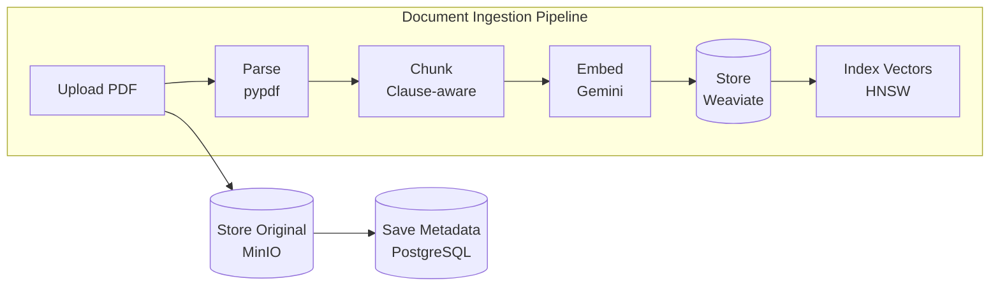

### Query Processing

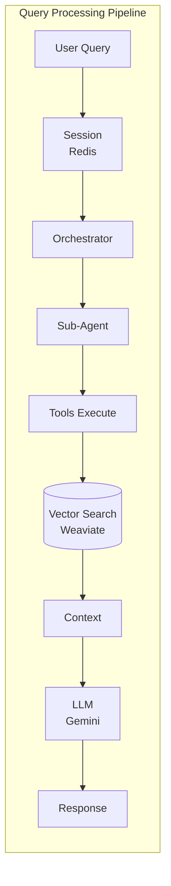

### Clause-Aware Chunking

```python
# Detects legal document structure
CLAUSE_PATTERN = r'^(\d+\.(?:\d+\.)*)\s*(.+?)(?:\n|$)'
SECTION_PATTERN = r'^(?:ARTICLE|SECTION|Part)\s+(\d+|[IVX]+)[:\.]?\s*(.+?)(?:\n|$)'

# Preserves:
# - Clause numbers (5.1, 5.1.1, etc.)
# - Section hierarchy
# - Context relationships
```

---

## Session & Memory Architecture

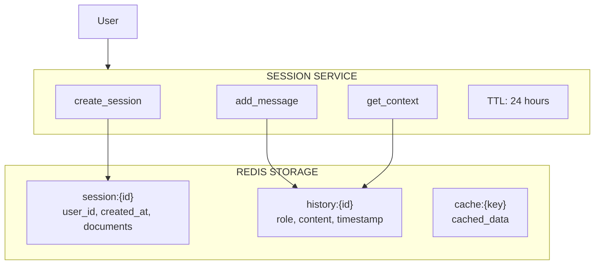

---

## A2A Protocol Integration

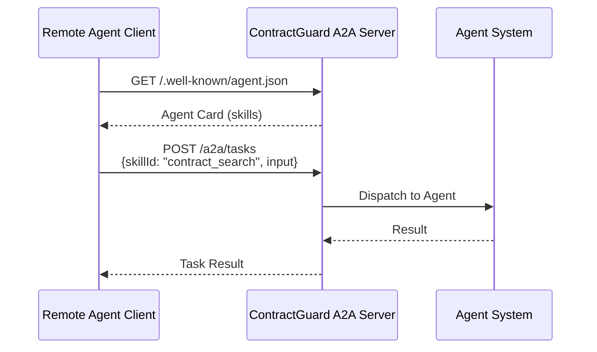

**Agent Card Skills:**

| Skill | Description |
|-------|-------------|
| `contract_search` | Semantic search |
| `risk_analysis` | Risk identification |
| `contract_comparison` | Compare contracts |
| `report_generation` | Generate reports |
| `document_ingestion` | Upload documents |
| `contract_qa` | Q&A about contracts |

---

## MCP Integration

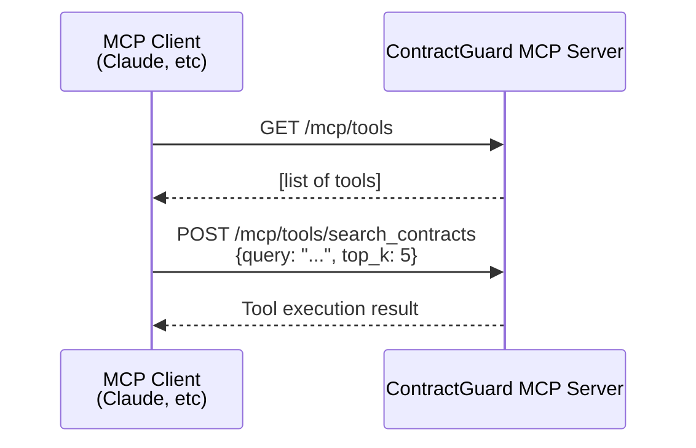

**Exposed MCP Tools:**

| Tool | Description |
|------|-------------|
| `search_contracts` | Vector search |
| `analyze_risk` | Risk analysis |
| `compare_contracts` | Comparison |
| `generate_report` | Summaries |
| `extract_clauses` | Clause extraction |

---

## Google ADK Native Features

### Long-Running Operations

Google ADK provides native support through:

| ADK Feature | Description |
|-------------|-------------|
| `Runner.run_async()` | Async execution for non-blocking operations |
| Streaming callbacks | Real-time response streaming |
| Session state | State maintained across interactions |

Our additions for enterprise persistence:
- **Redis persistence** - Session state survives server restarts
- **WebSocket updates** - Real-time progress to frontend
- **Task queue** - Background processing for large documents

### FunctionTools

```python
# Tools are automatically derived from function signature
search_contracts_tool = FunctionTool(func=search_contracts)
```

Each tool:
1. Receives parameters from the agent
2. Executes business logic (embedding, search, analysis)
3. Returns structured results
4. Includes tracing via OpenTelemetry

---

## Database Architecture (Future-Ready)

### Current MVP Data Flow

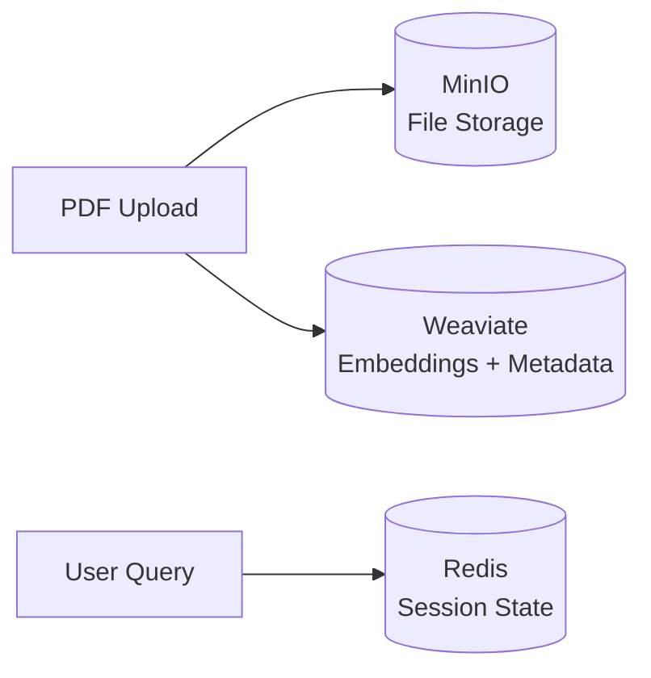

### PostgreSQL Schema (Prepared for Future Features)

The PostgreSQL database has tables defined but **not actively used** in the current MVP:

| Table | Schema | Future Purpose |
|-------|--------|----------------|
| **users** | id, email, role, preferences | User authentication, RBAC |
| **documents** | id, filename, status, user_id | Document ownership, audit trails |
| **sessions** | id, user_id, session_data | Persistent conversation history |

**Why tables exist but aren't used:**
- **MVP Focus**: The current implementation prioritizes agent functionality over user management
- **Future-Proofing**: Schema is ready for authentication, multi-tenancy, and audit logging
- **Separation of Concerns**: Weaviate handles vectors, MinIO handles files, Redis handles sessions

**Current data storage:**
- **PDFs** → MinIO (S3-compatible object storage)
- **Embeddings + Metadata** → Weaviate (vector database)
- **Sessions** → Redis (fast key-value store with TTL)
- **PostgreSQL** → Schema defined, ready for user features

---

## Deployment Architecture

### Local Development

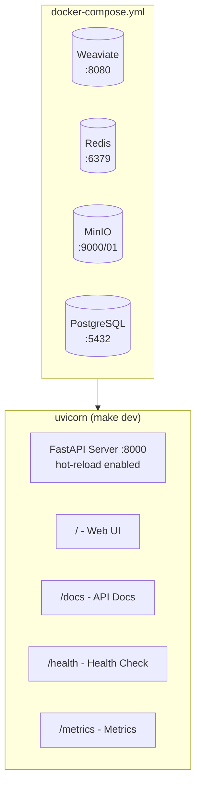

### Production (Cloud Run)

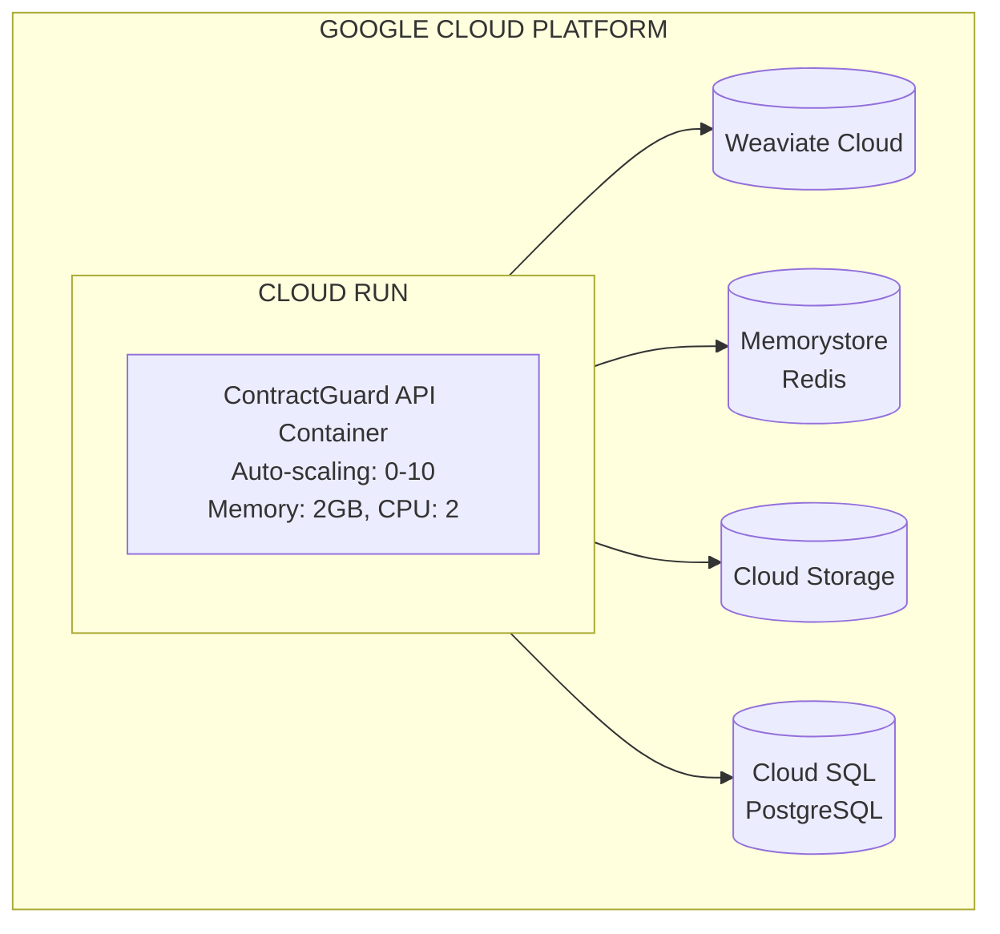

---

## Observability

### Tracing (OpenTelemetry)

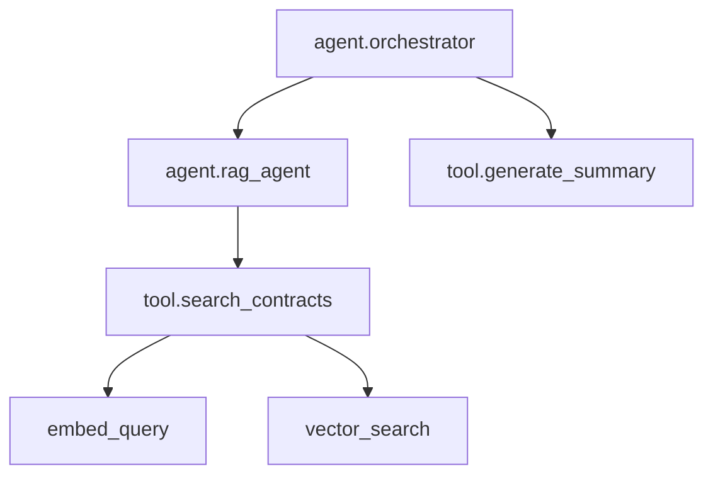

### Logging (structlog)

```json
{
  "event": "Search completed",
  "result_count": 5,
  "top_score": 0.92,
  "agent": "rag",
  "timestamp": "2024-11-14T10:30:00Z"
}
```

### Metrics Collection

The `/metrics` endpoint provides:
- Query counts and latencies
- Agent invocation statistics
- Tool usage tracking
- Error rates

---

## File Structure (Active Files)

```
src/
├── main.py              ◀── Entry point, routes, lifespan
├── config.py            ◀── Environment settings
│
├── agents/
│   ├── __init__.py      ◀── Agent exports, run_agent helper
│   ├── orchestrator.py  ◀── Root agent, sub-agent routing
│   ├── rag_agent.py     ◀── Document retrieval
│   ├── risk_agent.py    ◀── Risk analysis
│   ├── compare_agent.py ◀── Contract comparison
│   └── report_agent.py  ◀── Report generation
│
├── tools/
│   ├── search_tool.py   ◀── Vector search
│   ├── analysis_tool.py ◀── Clause analysis
│   ├── report_tool.py   ◀── Report tools
│   └── google_search_tool.py ◀── Web search
│
├── services/
│   ├── vector_service.py    ◀── Weaviate ops
│   ├── embedding_service.py ◀── Gemini embeddings
│   ├── chunking_service.py  ◀── Clause-aware chunking
│   └── storage_service.py   ◀── MinIO ops
│
├── memory/
│   ├── session_service.py   ◀── Redis sessions
│   └── memory_bank.py       ◀── Long-term memory
│
├── a2a/
│   ├── agent_card.py    ◀── Agent capabilities
│   ├── server.py        ◀── A2A endpoints
│   └── client.py        ◀── A2A client
│
├── mcp/
│   ├── toolset.py       ◀── MCP tool manager
│   └── server.py        ◀── MCP endpoints
│
├── api/
│   ├── websocket.py     ◀── Real-time updates
│   ├── tasks.py         ◀── Task management
│   └── evaluation.py    ◀── Eval endpoints
│
├── models/
│   ├── user.py          ◀── User model
│   └── document.py      ◀── Document model
│
├── core/
│   ├── database.py      ◀── PostgreSQL
│   └── redis_client.py  ◀── Redis utils
│
├── evaluation/
│   ├── evaluator.py     ◀── LLM-as-judge
│   └── test_cases.py    ◀── Test suites
│
└── observability/
    ├── logger.py        ◀── Structured logging
    ├── tracer.py        ◀── OpenTelemetry
    └── metrics.py       ◀── Metrics collection

frontend/
├── templates/
│   └── index.html       ◀── Web UI (Alpine.js + Tailwind)
├── static/
│   └── .gitkeep
└── README.md
```
