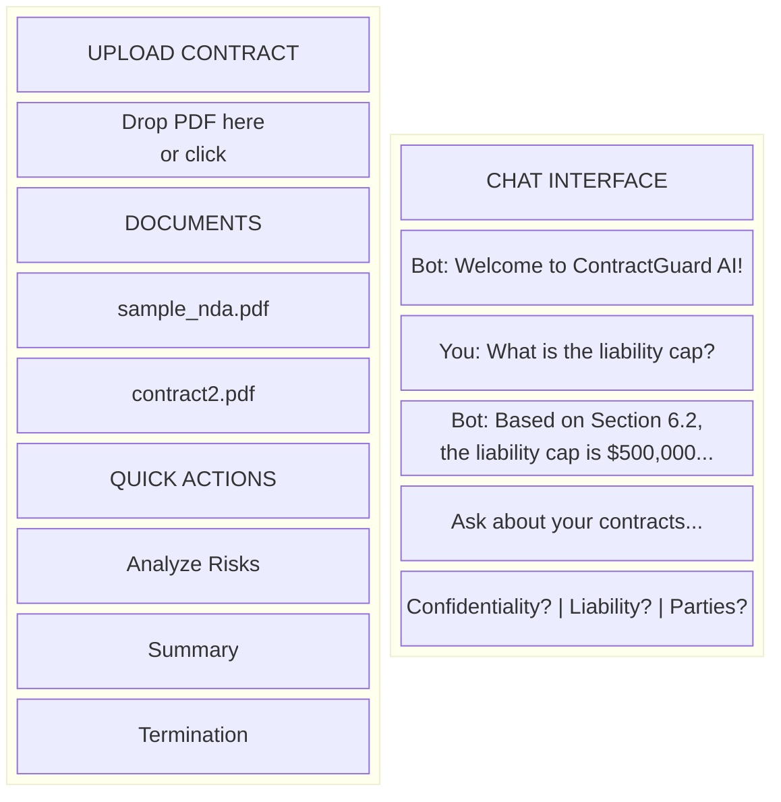

# ContractGuard AI - Quick Start Guide

Complete step-by-step guide to set up, run, test, and deploy ContractGuard AI.

## Table of Contents

1. [Prerequisites](#1-prerequisites)
2. [Project Setup](#2-project-setup)
3. [Infrastructure Setup](#3-infrastructure-setup)
4. [Database Setup](#4-database-setup)
5. [Running the Application](#5-running-the-application)
6. [Uploading Documents](#6-uploading-documents)
7. [Testing the System](#7-testing-the-system)
8. [Using the Frontend](#8-using-the-frontend)
9. [Running Tests](#9-running-tests)
10. [Deployment](#10-deployment)
11. [Troubleshooting](#11-troubleshooting)

---

## 1. Prerequisites

### Required Software

```bash
# Check versions
python --version    # Python 3.11+
docker --version    # Docker 24+
docker-compose --version  # Docker Compose 2.0+
```

### Install Dependencies

**macOS:**
```bash
# Install Python 3.11+
brew install python@3.11

# Install Docker Desktop
brew install --cask docker

# Install pandoc (for PDF conversion)
brew install pandoc
```

**Ubuntu/Debian:**
```bash
# Install Python
sudo apt update
sudo apt install python3.11 python3.11-venv python3-pip

# Install Docker
sudo apt install docker.io docker-compose

# Install pandoc
sudo apt install pandoc
```

### Get API Key

1. Go to [Google AI Studio](https://aistudio.google.com/app/apikey)
2. Create a new API key
3. Save it securely

---

## 2. Project Setup

### Clone and Setup

```bash
# Navigate to project
cd kaggle-capstone-contractguard

# Create virtual environment
python -m venv .venv
source .venv/bin/activate  # Linux/macOS
# .venv\Scripts\activate   # Windows

# Install dependencies
pip install -e ".[dev]"
```

### Configure Environment

```bash
# Copy environment template
cp .env.example .env

# Edit .env with your settings
nano .env  # or use any editor
```

**Required settings in `.env`:**
```env
# REQUIRED - Your Google API Key
GOOGLE_API_KEY=your_actual_api_key_here

# Optional - defaults work for local development
WEAVIATE_URL=http://localhost:8080
REDIS_URL=redis://localhost:6379
MINIO_ENDPOINT=localhost:9000
POSTGRES_HOST=localhost
```

---

## 3. Infrastructure Setup

### Start All Services

```bash
# Start infrastructure (Weaviate, Redis, MinIO, PostgreSQL)
make docker-up

# Wait for services to be healthy (about 30 seconds)
# You'll see output showing service URLs
```

**Service URLs:**
| Service | URL | Purpose |
|---------|-----|---------|
| Weaviate | http://localhost:8080 | Vector database |
| Redis | localhost:6379 | Sessions & caching |
| MinIO | http://localhost:9000 | Document storage |
| MinIO Console | http://localhost:9001 | Storage UI |
| PostgreSQL | localhost:5432 | User & metadata DB |

### Verify Services

```bash
# Check all services at once
make health

# Or check individually:
# Check Weaviate
curl http://localhost:8080/v1/.well-known/ready

# Check Redis (via Docker)
docker compose -f deploy/docker-compose.yml exec redis redis-cli ping  # Should return "PONG"

# Check MinIO
curl http://localhost:9000/minio/health/live
```

### Optional: Start GUI Tools

```bash
# Start pgAdmin and Redis Insight
make docker-tools

# pgAdmin: http://localhost:5050
#   Login: admin@contractguard.ai / admin
# Redis Insight: http://localhost:8001
```

---

## 4. Database Setup

### Run Migrations

```bash
# Apply database migrations
make db-upgrade

# Or manually with alembic
alembic upgrade head
```

### Verify Database

```bash
# Connect to PostgreSQL
docker exec -it kaggle-capstone-contractguard-postgres-1 psql -U postgres -d contractguard

# List tables
\dt

# You should see: users, documents, sessions
```

---

## 5. Running the Application

### Development Mode

```bash
# Start the API server
make dev

# Or directly with uvicorn
uvicorn src.main:app --reload --host 0.0.0.0 --port 8000
```

### Verify API is Running

```bash
# Health check
curl http://localhost:8000/health

# Expected response:
# {"status":"healthy","services":{"weaviate":true,"redis":true,"minio":true}}
```

### Access API Documentation

Open in browser: **http://localhost:8000/docs**

This shows the interactive Swagger UI with all endpoints.

---

## 6. Uploading Documents

### Document Locations

```
Project Structure:
├── examples/contracts/          # Sample contracts
│   ├── sample_nda.md           # Sample NDA (Markdown)
│   └── sample_nda.pdf          # Sample NDA (PDF - generated)
├── data/documents/
│   ├── sample/                 # Additional samples
│   │   └── master_services_agreement.md
│   ├── uploads/                # Your uploads (gitignored)
│   └── processed/              # Processed docs (gitignored)
```

### Convert Sample to PDF

```bash
# Using make command
make upload-sample

# Or manually
pandoc examples/contracts/sample_nda.md -o examples/contracts/sample_nda.pdf
```

### Upload via API

```bash
# Upload sample NDA
curl -X POST "http://localhost:8000/api/v1/documents/upload" \
  -F "file=@examples/contracts/sample_nda.pdf" \
  -F "collection_name=contracts"

# Upload MSA
curl -X POST "http://localhost:8000/api/v1/documents/upload" \
  -F "file=@data/documents/sample/master_services_agreement.md" \
  -F "collection_name=contracts"
```

### Upload Response

```json
{
  "document_id": "abc123-...",
  "filename": "sample_nda.pdf",
  "chunks": 15,
  "message": "Document uploaded and processed successfully"
}
```

---

## 7. Testing the System

### Basic Query

```bash
# Ask a question about uploaded contracts
curl -X POST "http://localhost:8000/api/v1/query" \
  -H "Content-Type: application/json" \
  -d '{"question": "What is the confidentiality period?"}'
```

### Expected Response

```json
{
  "answer": "Based on the NDA, the confidentiality obligations survive for a period of **five (5) years** from the date of disclosure of each item of Confidential Information (Section 3.3).",
  "sources": ["sample_nda.pdf - Section 3.3"],
  "session_id": "auto-generated-id"
}
```

### Test Queries to Try

| Query | Expected Information |
|-------|---------------------|
| "What is the liability cap?" | $500,000 |
| "What are the termination conditions?" | 30 days notice |
| "Who are the parties?" | TechCorp Industries, Receiving Party |
| "What risks are in this contract?" | Liability, jurisdiction, survival period |

### Using the Test Query File

See `examples/test_queries.md` for comprehensive test scenarios.

---

## 8. Using the Frontend

The web interface is **automatically served** when you run the API server. No additional setup required!

### Access the Web UI

```bash
# Start the server (if not already running)
make dev

# Open in browser
open http://localhost:8000/
```

The frontend is served at the root URL: **http://localhost:8000/**

### Web Interface Overview



**Layout Overview:**

| Left Panel | Right Panel |
|------------|-------------|
| Upload Contract (drag & drop) | Chat Interface |
| Documents List | Message History |
| Quick Actions | Query Input |

### Frontend Features

| Feature | Description |
|---------|-------------|
| **Upload Contract** | Drag & drop or click to upload PDF files |
| **Documents** | View and select from uploaded contracts |
| **Chat Interface** | Ask natural language questions |
| **Quick Actions** | One-click analysis buttons |
| **Suggested Queries** | Common questions at the bottom |
| **Session** | Maintains conversation context |

### Step-by-Step Usage

1. **Upload a Document**
   - Drag a PDF into the upload area, OR
   - Click the upload area to browse files
   - Wait for the "uploaded successfully" message

2. **Select a Document** (optional)
   - Click on a document in the Documents list
   - This shows document details in the chat

3. **Ask Questions**
   - Type your question in the input box
   - Press Enter or click the send button
   - Use Quick Actions for common analyses:
     - **Analyze Risks** - Find potential issues
     - **Executive Summary** - Get an overview
     - **Termination Terms** - Extract exit conditions
     - **List Obligations** - See all requirements

4. **Use Suggested Queries**
   - Click buttons like "Confidentiality period?" for quick answers

### Example Workflow

```
1. Open http://localhost:8000/
2. Upload "my_contract.pdf" via drag & drop
3. Click "Analyze Risks" in Quick Actions
4. Ask follow-up: "How can we mitigate the liability risk?"
5. Ask: "Generate an executive summary"
```

---

## 9. Running Tests

### Run All Tests

```bash
# Run full test suite
make test

# Or with pytest directly
pytest tests/ -v
```

### Run Specific Tests

```bash
# Unit tests only
pytest tests/unit/ -v

# Integration tests only
pytest tests/integration/ -v

# Specific test file
pytest tests/unit/test_chunking.py -v

# With coverage
pytest tests/ --cov=src --cov-report=html
```

### Run Evaluation Suite

```bash
# Quick evaluation (3 test cases)
make test-quick

# Full evaluation (20+ test cases)
make test-full

# Or via API
curl -X POST "http://localhost:8000/api/v1/evaluation/suite" \
  -H "Content-Type: application/json" \
  -d '{"suite_name": "quick"}'
```

---

## 10. Deployment

### Docker Deployment (Recommended)

```bash
# Build Docker image
make docker-build

# Start all services including API
make docker-all

# View logs
make docker-logs
```

### Cloud Run Deployment

**Prerequisites:**
- Google Cloud account
- `gcloud` CLI installed
- Project created in GCP

```bash
# Configure project
export GCP_PROJECT_ID=your-project-id
export GCP_REGION=us-central1

# Authenticate
gcloud auth login
gcloud config set project $GCP_PROJECT_ID

# Deploy
make deploy
```

### Environment for Production

Update `.env` for production:

```env
APP_ENV=production
DEBUG=false

# Use managed services
WEAVIATE_URL=https://your-weaviate-cloud-url
REDIS_URL=redis://your-memorystore-ip:6379
POSTGRES_HOST=your-cloud-sql-ip

# Security
SECRET_KEY=generate-with-openssl-rand-hex-32
```

---

## 11. Troubleshooting

### Common Issues

#### "Connection refused" errors

```bash
# Check if Docker services are running
docker ps

# Restart services
make docker-down
make docker-up
```

#### "API key invalid" errors

1. Verify your `GOOGLE_API_KEY` in `.env`
2. Check the key has Gemini API access enabled
3. Try generating a new key

#### Database connection errors

```bash
# Check PostgreSQL is running
docker exec -it kaggle-capstone-contractguard-postgres-1 pg_isready

# Reset database
make db-reset
```

#### Weaviate not ready

```bash
# Check Weaviate logs
docker logs kaggle-capstone-contractguard-weaviate-1

# Restart Weaviate
docker-compose -f deploy/docker-compose.yml restart weaviate
```

#### Document upload fails

```bash
# Check MinIO health
curl http://localhost:9000/minio/health/live

# Verify bucket exists (via MinIO console)
# http://localhost:9001 (minioadmin/minioadmin)
```

### Get Help

- **API Docs:** http://localhost:8000/docs
- **Health Check:** http://localhost:8000/health
- **Logs:** `docker-compose -f deploy/docker-compose.yml logs -f`

---

## Quick Reference Commands

```bash
# Setup
make install           # Install dependencies
make docker-up         # Start infrastructure
make db-upgrade        # Run migrations

# Development
make dev               # Start dev server
make health            # Check service health

# Testing
make test              # Run all tests
make test-quick        # Quick evaluation
make upload-sample     # Upload sample contract

# Deployment
make docker-all        # Start everything
make deploy            # Deploy to Cloud Run

# Cleanup
make docker-down       # Stop services
make clean             # Clean temp files
```

---

## Next Steps

1. Upload your own contracts
2. Try the evaluation suite
3. Explore the A2A and MCP endpoints
4. Customize agents for your use case
5. Deploy to production

**Need help?** Check the [ARCHITECTURE.md](ARCHITECTURE.md) for system design details.
