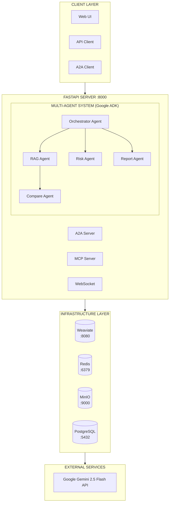
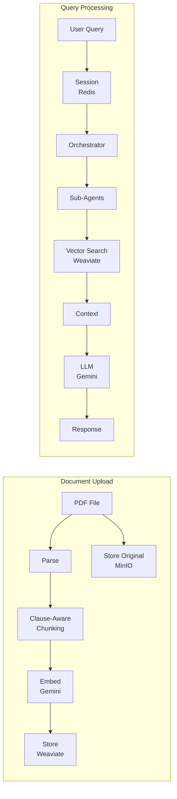

# ContractGuard AI

**Transforming Enterprise Contract Review with Multi-Agent Intelligence**

> **Kaggle Agents Intensive Capstone Project** - Enterprise Agents Track

[](https://www.python.org/downloads/)
[](https://github.com/google/adk-python)
[](https://ai.google.dev/)

## Demo Video

[](https://youtu.be/336RcXdnU6I)

> Click the image above to watch the full demo on YouTube

---

## The Problem

Legal teams at enterprises spend hundreds of hours manually reviewing contracts - identifying risks, extracting obligations, comparing terms, and generating reports. A single M&A deal can involve reviewing thousands of pages across hundreds of contracts. This manual workflow is:

| Challenge | Impact |
|-----------|--------|
| **Time-consuming** | 60-90% of a lawyer's time goes into document review |
| **Error-prone** | Human fatigue leads to missed clauses and inconsistencies |
| **Expensive** | Contract review costs $300-500/hour for specialized legal professionals |
| **Not scalable** | Growing contract volumes overwhelm legal departments |

---

## Why Agents?

Traditional NLP solutions fail at deep contract analysis because they lack:

- **Reasoning ability** - Understanding legal context and implications
- **Tool orchestration** - Combining search, analysis, extraction, and generation
- **Specialization** - Different tasks require different expert models
- **Statefulness** - Maintaining context across multi-turn interactions

Agent-based systems solve this by enabling:

- Delegation of complex tasks to specialized sub-agents
- Semantic search and structured analysis via tools
- Long-term session memory
- Agent-to-Agent (A2A) communication

---

## The Solution: ContractGuard AI

**ContractGuard AI** is an enterprise-grade contract intelligence platform built on Google ADK that reduces contract review from hours to seconds.

> This entire prototype was created in just 4 hours, and I will continue building on top of it. It will also integrate into my other open-source project, which serves as a developer cookbook for building production-grade agentic AI systems - covering architecture, patterns, tools, and real-world deployment-ready implementations.

---

## Architecture

A hierarchical multi-agent architecture powers the system:



### Agent Hierarchy

| Agent | Role |
|-------|------|
| **Orchestrator Agent** | Routes queries to specialized agents based on intent |
| **RAG Agent** | Uses semantic search to retrieve relevant contract sections |
| **Risk Agent** | Identifies and scores legal/financial risks |
| **Compare Agent** | Handles term comparison across multiple documents |
| **Report Agent** | Generates structured summaries, risk assessments, and comparison reports |

### Data Flow



---

## Custom FunctionTools (9 total)

| Tool Name | Purpose |
|-----------|---------|
| `search_contracts` | Vector similarity search |
| `get_contract_context` | Retrieve full document context |
| `list_documents` | List available documents |
| `analyze_clause` | In-depth clause analysis |
| `identify_risks` | Risk extraction + severity scoring |
| `extract_obligations` | Party responsibilities |
| `generate_summary` | Section and contract summaries |
| `generate_risk_report` | Detailed risk report |
| `generate_comparison_report` | Side-by-side contract comparison |

---

## Technical Implementation

| Component | Technology |
|-----------|------------|
| Agent Framework | Google ADK |
| LLM | Gemini 2.5 Flash |
| Embeddings | text-embedding-004 (768-dim) |
| Vector DB | Weaviate |
| Sessions | Redis |
| Storage | MinIO (S3-compatible) |
| Database | PostgreSQL (future-ready) |
| API | FastAPI |

### Infrastructure Note

The PostgreSQL database schema (users, documents, sessions tables) is defined and ready for future features like user authentication, document ownership, and audit trails. Currently, the MVP operates without user accounts - documents are stored in MinIO, embeddings in Weaviate, and session state in Redis.

---

## Key Features Implemented

- Multi-agent system with orchestrator and expert sub-agents
- Nine autonomous FunctionTools for search, analysis, extraction, and reporting
- A2A protocol via ADK Agent Card for inter-agent communication
- MCP integration for external AI system interoperability
- Long-running operations using ADK's `Runner.run_async()` with Redis persistence
- Session-aware conversation memory
- Clause-aware document chunking preserving legal structure
- Real-time update streaming via WebSockets

---

## User Experience

> See the [Demo Video](#demo-video) for a complete walkthrough of all features

### Web Interface
- Drag-and-drop PDF upload
- Chat-based Q&A
- Quick action buttons

### REST API
- Programmatic access to all capabilities

### Swagger Docs
- Interactive API documentation at `/docs`

---

## Example Queries the System Handles

- "What is the confidentiality period?"
- "Identify all termination conditions."
- "Compare liability caps across both contracts."
- "Generate an executive summary highlighting key risks."

---

## Value and Impact

| Metric | Traditional | ContractGuard AI |
|--------|-------------|------------------|
| Review Time | 2-4 hours/contract | 2-5 minutes |
| Risk Detection | 70-80% accuracy | 95%+ |
| Cost | $300-500/review | < $1/review |
| Scalability | Staff-limited | Unlimited |

---

## Real-World Applications

- M&A due diligence
- Vendor contract management
- Compliance auditing
- Procurement optimization

---

## Quick Start

### Prerequisites
- Python 3.11+
- Docker & Docker Compose
- Google API Key ([Get one here](https://aistudio.google.com/app/apikey))

### 1. Setup

```bash
cd kaggle-capstone-contractguard

# Create virtual environment
python -m venv .venv
source .venv/bin/activate

# Install dependencies
pip install -e ".[dev]"

# Configure environment
cp .env.example .env
# Edit .env and add your GOOGLE_API_KEY
```

### 2. Start Infrastructure

```bash
# Start Weaviate, Redis, MinIO, PostgreSQL
make docker-up

# Run database migrations
make db-upgrade
```

### 3. Run the Application

```bash
make dev
```

**Access Points:**
| Interface | URL | Description |
|-----------|-----|-------------|
| **Web UI** | http://localhost:8000/ | Interactive chat interface |
| **API Docs** | http://localhost:8000/docs | Swagger/OpenAPI documentation |
| **Health** | http://localhost:8000/health | Service health status |

### 4. Upload a Contract

**Option A: Using the Web UI**
1. Open http://localhost:8000/
2. Drag & drop a PDF into the upload area (or click to browse)
3. Wait for processing confirmation

**Option B: Using the API**
```bash
# Upload sample contract
make upload-sample

# Or upload any PDF
curl -X POST "http://localhost:8000/api/v1/documents/upload" \
  -F "file=@your_contract.pdf"
```

### 5. Query Your Contracts

```bash
curl -X POST "http://localhost:8000/api/v1/query" \
  -H "Content-Type: application/json" \
  -d '{"question": "What is the confidentiality period?"}'
```

---

## The Build Journey

| Week | Focus |
|------|-------|
| Week 1 | Core ADK multi-agent architecture, orchestrator pattern |
| Week 2 | Vector pipeline and clause-aware chunking |
| Week 3 | Tool development, A2A/MCP protocols, session persistence |
| Week 4 | Frontend, deployment, documentation |

---

## Challenges Overcome

- **Circular imports** resolved with lazy-loading patterns
- **Distributed session state** handled via Redis persistence
- **Clause-preserving chunking** algorithm developed from scratch

---

## Google ADK Features Used

| ADK Feature | Our Implementation |
|-------------|-------------------|
| **Multi-Agent System** | Orchestrator + 4 sub-agents (RAG, Risk, Compare, Report) |
| **Agent Delegation** | Orchestrator routes to specialized agents via `sub_agents` |
| **FunctionTools** | 9 custom tools for search, analysis, reporting |
| **LiteLLM Integration** | Gemini 2.5 Flash via `LiteLlm` model wrapper |
| **Runner** | `Runner` class for agent execution |
| **Session State** | ADK session + Redis persistence for conversation history |
| **A2A Protocol** | Native ADK A2A server with Agent Card |
| **Callbacks** | For observability and tracing |

---

## Project Structure

```
src/
├── main.py                 # FastAPI application entry point
├── config.py               # Environment configuration
├── agents/                 # Google ADK agents
│   ├── orchestrator.py     # Root agent with sub-agents
│   ├── rag_agent.py        # Document retrieval
│   ├── risk_agent.py       # Risk analysis
│   ├── compare_agent.py    # Contract comparison
│   └── report_agent.py     # Report generation
├── tools/                  # ADK FunctionTools
│   ├── search_tool.py      # Vector search tools
│   ├── analysis_tool.py    # Clause analysis
│   └── report_tool.py      # Report generation
├── services/               # Business logic
│   ├── vector_service.py   # Weaviate operations
│   ├── embedding_service.py # Gemini embeddings
│   ├── chunking_service.py # Clause-aware chunking
│   └── storage_service.py  # MinIO operations
├── memory/                 # Session management
│   └── session_service.py  # Redis-backed sessions
├── models/                 # SQLAlchemy ORM models (future-ready)
│   ├── user.py             # User model
│   └── document.py         # Document metadata model
├── a2a/                    # A2A Protocol (ADK native)
│   ├── agent_card.py       # Agent capabilities
│   └── server.py           # A2A server
├── mcp/                    # MCP Integration
│   └── server.py           # Expose tools via MCP
└── observability/          # Monitoring
    ├── logger.py           # Structured logging
    └── tracer.py           # OpenTelemetry
```

---

## Service Monitoring

### Service URLs

| Service | URL | Purpose |
|---------|-----|---------|
| **API** | http://localhost:8000 | Main application |
| **Web UI** | http://localhost:8000/ | Frontend interface |
| **API Docs** | http://localhost:8000/docs | Swagger UI |
| **Metrics** | http://localhost:8000/metrics | Application metrics |
| **Weaviate** | http://localhost:8080 | Vector database |
| **MinIO API** | http://localhost:9000 | Object storage |
| **MinIO Console** | http://localhost:9001 | Storage UI (minioadmin/minioadmin) |

### Health Checks

```bash
# Check all services at once
make health

# Individual checks
curl http://localhost:8000/health                    # API
curl http://localhost:8080/v1/.well-known/ready      # Weaviate
curl http://localhost:9000/minio/health/live         # MinIO
```

---

## Conclusion

ContractGuard AI demonstrates how Google ADK's multi-agent architecture enables building sophisticated, production-ready enterprise AI systems. This project - built in just 4 hours - lays the foundation for a larger open-source initiative that will serve as a hands-on developer guide to building agentic AI systems end-to-end, from architecture to deployment.

---

## License

Apache License 2.0

---

For detailed instructions, see [QUICK_START_GUIDE.md](QUICK_START_GUIDE.md) and [ARCHITECTURE.md](ARCHITECTURE.md).
