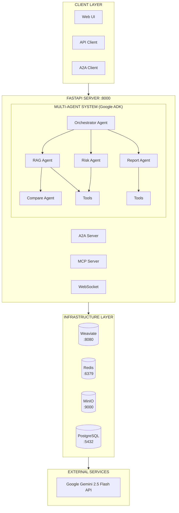
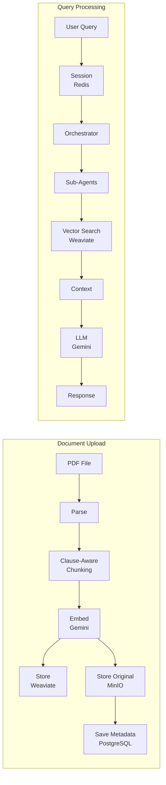

# ContractGuard AI

**Enterprise Contract Intelligence Platform powered by Google ADK & Gemini**

> **Kaggle Agents Intensive Capstone Project** - Enterprise Agents Track

[](https://www.python.org/downloads/)
[](https://github.com/google/adk-python)
[](https://ai.google.dev/)

---

## Overview

**ContractGuard AI** is an enterprise-grade contract intelligence platform that uses a multi-agent system to analyze, assess risks, compare contracts, and generate comprehensive reports.

### The Problem

Legal teams spend **hundreds of hours** manually reviewing contracts. ContractGuard AI automates this using:
- **Multi-Agent Architecture**: Specialized agents for RAG, Risk, Compare, and Report tasks
- **Semantic Search**: Vector-based retrieval with Weaviate
- **Gemini 2.5 Flash**: State-of-the-art language model
---

## Architecture



### Data Flow



---

## Quick Start

### Prerequisites
- Python 3.11+
- Docker & Docker Compose
- Google API Key ([Get one here](https://aistudio.google.com/app/apikey))

### 1. Setup

```bash
cd kaggle-capstone-contractguard

# Create virtual environment
python -m venv .venv
source .venv/bin/activate

# Install dependencies
pip install -e ".[dev]"

# Configure environment
cp .env.example .env
# Edit .env and add your GOOGLE_API_KEY
```

### 2. Start Infrastructure

```bash
# Start Weaviate, Redis, MinIO, PostgreSQL
make docker-up

# Run database migrations
make db-upgrade
```

### 3. Run the Application

```bash
make dev
```

**Access Points:**
| Interface | URL | Description |
|-----------|-----|-------------|
| **Web UI** | http://localhost:8000/ | Interactive chat interface |
| **API Docs** | http://localhost:8000/docs | Swagger/OpenAPI documentation |
| **Health** | http://localhost:8000/health | Service health status |

### 4. Upload a Contract

**Option A: Using the Web UI**
1. Open http://localhost:8000/
2. Drag & drop a PDF into the upload area (or click to browse)
3. Wait for processing confirmation

**Option B: Using the API**
```bash
# Upload sample contract
make upload-sample

# Or upload any PDF
curl -X POST "http://localhost:8000/api/v1/documents/upload" \
  -F "file=@your_contract.pdf"
```

### 5. Query Your Contracts

**Option A: Using the Web UI**
1. Type your question in the chat input
2. Use quick action buttons for common analyses
3. Click suggested queries for fast exploration

**Option B: Using the API**
```bash
curl -X POST "http://localhost:8000/api/v1/query" \
  -H "Content-Type: application/json" \
  -d '{"question": "What is the confidentiality period?"}'
```

---

## Using the Web Interface

The web UI provides a complete contract analysis experience:

### Features
- **Document Upload** - Drag & drop or click to upload PDF contracts
- **Chat Interface** - Natural language Q&A about your contracts
- **Quick Actions** - One-click risk analysis, summaries, and more
- **Document List** - View and select uploaded contracts
- **Session Management** - Maintain conversation context

### Quick Actions
| Action | Description |
|--------|-------------|
| Analyze Risks | Identify potential legal/financial risks |
| Executive Summary | Generate a high-level overview |
| Termination Terms | Extract termination conditions |
| List Obligations | Enumerate party responsibilities |

### Example Queries
- "What is the confidentiality period?"
- "What is the liability cap?"
- "Who are the parties involved?"
- "What are the payment terms?"
- "Summarize the key obligations"

---

## Google ADK Features Used

This project leverages Google ADK's native capabilities:

| ADK Feature | Our Implementation |
|-------------|-------------------|
| **Multi-Agent System** | Orchestrator + 4 sub-agents (RAG, Risk, Compare, Report) |
| **Agent Delegation** | Orchestrator routes to specialized agents via `sub_agents` |
| **FunctionTools** | 9 custom tools for search, analysis, reporting |
| **LiteLLM Integration** | Gemini 2.5 Flash via `LiteLlm` model wrapper |
| **Runner** | `Runner` class for agent execution |
| **Session State** | ADK session + Redis persistence for conversation history |
| **A2A Protocol** | Native ADK A2A server with Agent Card |
| **Callbacks** | For observability and tracing |

### Long-Running Operations

Google ADK provides native support for long-running operations through:
- **`Runner.run_async()`** - Async execution for non-blocking operations
- **Streaming** - Real-time response streaming via callbacks
- **Session persistence** - State maintained across interactions

Our additions for enterprise use:
- **Redis persistence** - Session state survives server restarts
- **WebSocket updates** - Real-time progress to frontend
- **Task queue** - Background processing for large documents

---

## API Endpoints

| Endpoint | Method | Description |
|----------|--------|-------------|
| `/api/v1/query` | POST | Query the agent system |
| `/api/v1/search` | POST | Direct vector search |
| `/api/v1/documents/upload` | POST | Upload a contract |
| `/api/v1/documents/{id}` | GET | Get document details |
| `/api/v1/sessions` | POST | Create a session |
| `/health` | GET | Health check |
| `/a2a/.well-known/agent.json` | GET | A2A Agent Card |
| `/mcp/tools` | GET | List MCP tools |

---

## Project Structure

```
src/
├── main.py                 # FastAPI application entry point
├── config.py               # Environment configuration
├── agents/                 # Google ADK agents
│   ├── orchestrator.py     # Root agent with sub-agents
│   ├── rag_agent.py        # Document retrieval
│   ├── risk_agent.py       # Risk analysis
│   ├── compare_agent.py    # Contract comparison
│   └── report_agent.py     # Report generation
├── tools/                  # ADK FunctionTools
│   ├── search_tool.py      # Vector search tools
│   ├── analysis_tool.py    # Clause analysis
│   └── report_tool.py      # Report generation
├── services/               # Business logic
│   ├── vector_service.py   # Weaviate operations
│   ├── embedding_service.py # Gemini embeddings
│   ├── chunking_service.py # Clause-aware chunking
│   └── storage_service.py  # MinIO operations
├── memory/                 # Session management
│   └── session_service.py  # Redis-backed sessions
├── a2a/                    # A2A Protocol (ADK native)
│   ├── agent_card.py       # Agent capabilities
│   └── server.py           # A2A server
├── mcp/                    # MCP Integration
│   └── server.py           # Expose tools via MCP
└── observability/          # Monitoring
    ├── logger.py           # Structured logging
    └── tracer.py           # OpenTelemetry
```

---

## Kaggle Capstone Features

| Feature | Implementation |
|---------|----------------|
| Multi-agent system | Orchestrator + 4 sub-agents |
| Custom tools | 9 FunctionTools |
| A2A Protocol | Native ADK A2A server |
| MCP Tools | MCPToolset integration |
| Sessions & State | Redis + ADK sessions |
| Observability | OpenTelemetry tracing |
| Gemini LLM | gemini-2.5-flash |
| Deployment | Docker + Cloud Run |

---

## Tech Stack

| Component | Technology |
|-----------|------------|
| Agent Framework | Google ADK |
| LLM | Gemini 2.5 Flash |
| Embeddings | text-embedding-004 (768-dim) |
| Vector DB | Weaviate |
| Sessions | Redis |
| Storage | MinIO |
| Database | PostgreSQL |
| API | FastAPI |

---

## Service Monitoring

### Service URLs

| Service | URL | Purpose |
|---------|-----|---------|
| **API** | http://localhost:8000 | Main application |
| **Web UI** | http://localhost:8000/ | Frontend interface |
| **API Docs** | http://localhost:8000/docs | Swagger UI |
| **Metrics** | http://localhost:8000/metrics | Application metrics |
| **Weaviate** | http://localhost:8080 | Vector database |
| **MinIO API** | http://localhost:9000 | Object storage |
| **MinIO Console** | http://localhost:9001 | Storage UI (minioadmin/minioadmin) |

### Health Checks

```bash
# Check all services at once
make health

# Individual checks
curl http://localhost:8000/health                    # API
curl http://localhost:8080/v1/.well-known/ready      # Weaviate
curl http://localhost:9000/minio/health/live         # MinIO
docker compose -f deploy/docker-compose.yml exec redis redis-cli ping    # Redis
docker compose -f deploy/docker-compose.yml exec postgres pg_isready -U postgres  # PostgreSQL
```

### Metrics

```bash
# Get application metrics (queries, tool usage, errors)
curl http://localhost:8000/metrics
```

---

## License

Apache License 2.0

---

## Getting Started

```bash
# Quick start (3 commands)
make docker-up      # Start infrastructure
make db-upgrade     # Initialize database
make dev            # Start the application
```

Then open **http://localhost:8000** in your browser to access the Web UI, or use the API directly.

For detailed instructions, see [QUICK_START_GUIDE.md](QUICK_START_GUIDE.md).
